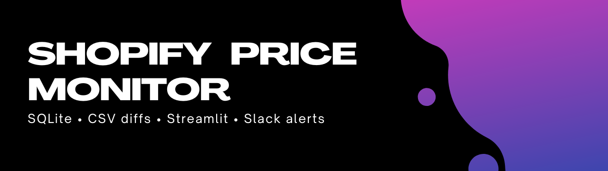
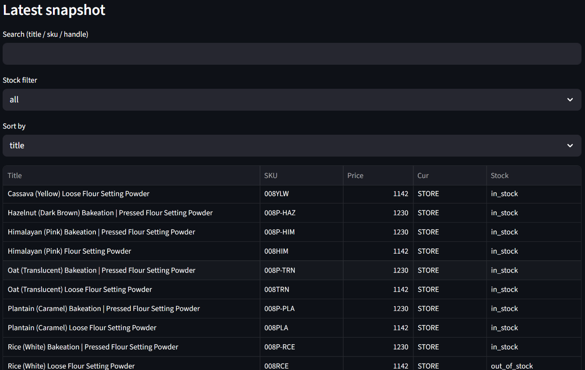
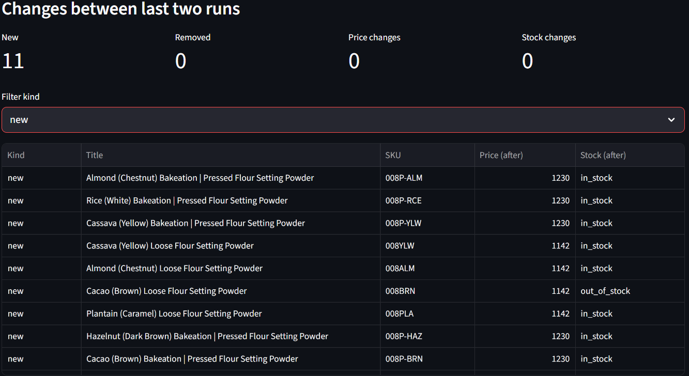

Production‑shaped monitor for Shopify stores/collections: snapshots → SQLite history → diff reports → CSV exports (+ optional Slack alerts).  
Includes a Streamlit dashboard for quick review.

## Highlights
- Shopify public JSON endpoints: `/products.json`, `/collections/<handle>/products.json`
- SQLite snapshots (history) + diff between runs (new / price / stock)
- CSV exports: `current_prices.csv`, `price_changes.csv`
- Polite crawling (min interval + retries)
- Offline tests (fixtures)

## Demo (Streamlit screenshots)

**Latest snapshot**


**Changes between last two runs**


> Note: for `new` items the `before_*` fields are empty because the item didn’t exist in the previous snapshot.

---

## Quickstart

### Install
```bash
python -m venv .venv
# Windows (PowerShell):
#   Set-ExecutionPolicy -Scope Process -ExecutionPolicy Bypass
#   .\.venv\Scripts\Activate.ps1
# Linux/Mac:
#   source .venv/bin/activate

pip install -e ".[dev]"
pytest -q
```

### Run (collection mode)
```bash
price-monitor run \
  --store www.beautybakerie.com \
  --collection flour-setting-powder \
  --currency STORE \
  --db outputs/monitor.db \
  --out docs/demo \
  --min-interval 1.0 \
  --max-pages 1
```

Run again later (same command) to detect changes.

### Streamlit dashboard
```bash
pip install streamlit pandas
python -m streamlit run dashboard/app.py
```

In the sidebar, set **SQLite DB path** to your DB file (e.g. `outputs/monitor.db`).

---

## Input / Output

### Input
- `--store` Shopify domain (e.g. `www.beautybakerie.com`)
- One of:
  - `--collection <handle>` – monitor a specific collection
  - `--targets-csv <file.csv>` – monitor explicit product handles/URLs (client provided)
- `--db` path to SQLite database
- `--out` output folder for CSV reports
- `--min-interval` delay between requests

### Output
- `current_prices.csv` – latest snapshot export (product/variant level)
- `price_changes.csv` – diff vs previous snapshot (new / price / stock)
- SQLite DB (`--db`) – historical snapshots

---

## Notes / limitations
Some stores disable public JSON endpoints or use anti‑bot protection. In those cases you may need targets mode, HTML fallback, headless browser (Playwright), or official APIs (client credentials).

---

## License
MIT
